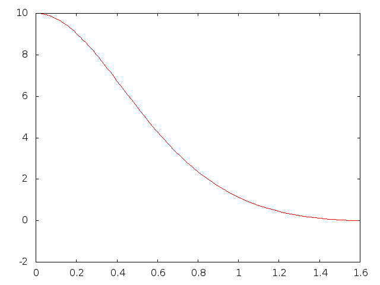
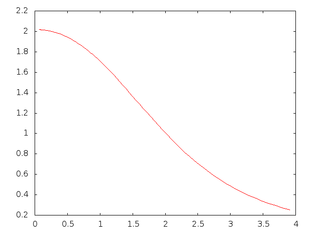

# Midterm 2 for phys2200

In part 1, we are solving the set of differential equations for the radius and mass of a white dwarf star when the star's 
central density is 10. The final radius and mass occur when the star's density reaches 0. In this case, the radius is 1.59165e+00
and the mass is 1.29801e+00. The figure below shows the density of the star plotted against its radius.

In part 2, we are looking to see how the final radius and mass are related by solving the equations for white dwarf stars
with central densities ranging from 0.08 to 1000000. The figure below shows the results with final mass plotted against
final radius.

